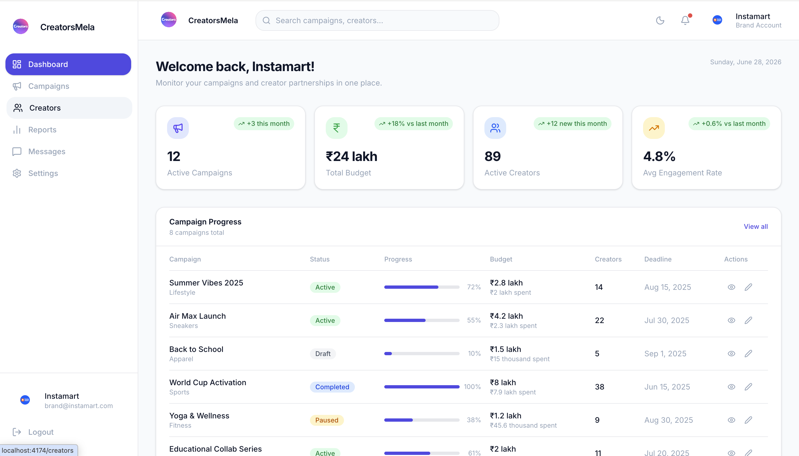
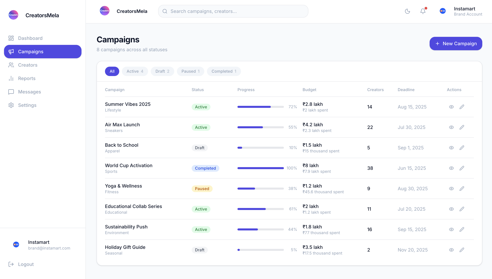
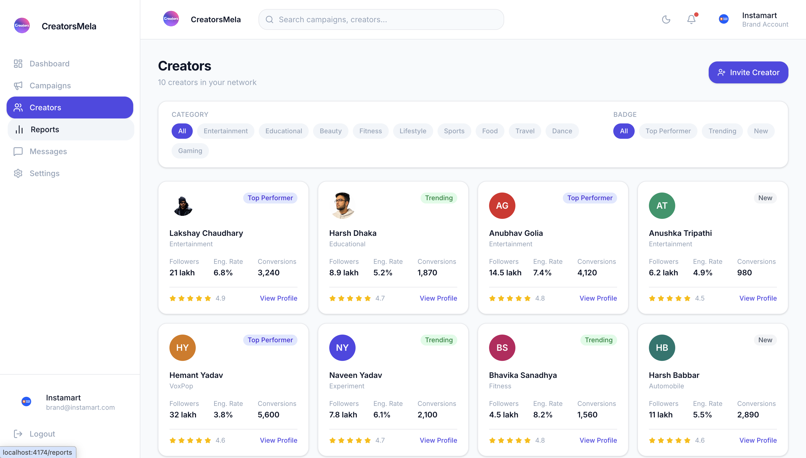
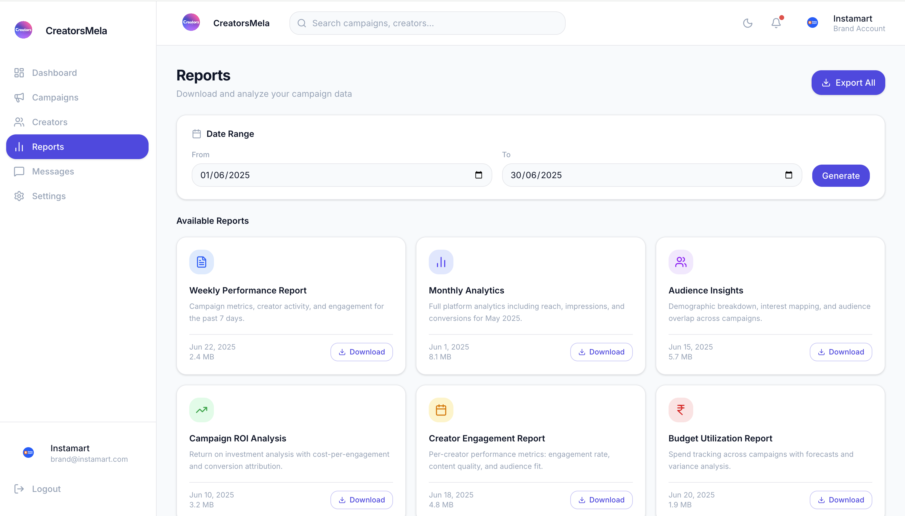
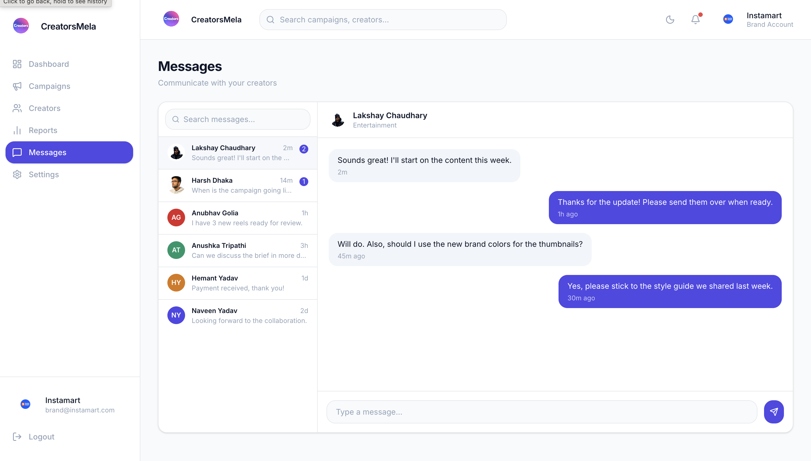
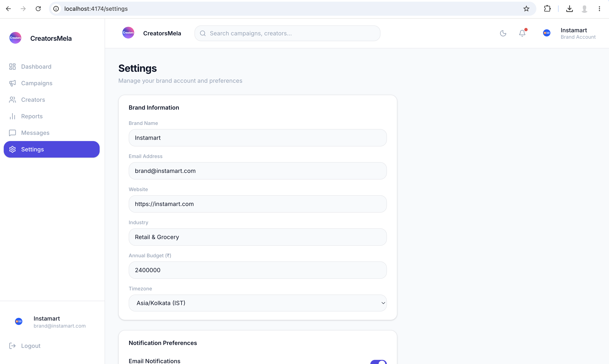

# CreatorsMela Brand Dashboard

A modern, responsive Brand Dashboard designed for CreatorsMela, enabling brands to monitor influencer marketing campaigns, manage creators, analyze campaign performance, communicate with creators, and generate reports from a single, intuitive interface.

This project was built as part of the CreatorsMela Front-End Developer Assignment, with a strong focus on thoughtful product decisions, clean UI, responsive design, and scalable front-end architecture.

---

## 🌐 Live Demo

**Live URL:** https://your-live-url.com

---

## 📂 GitHub Repository

**Repository:** https://github.com/your-username/creatorsmela-dashboard

---

# 📸 Screenshots

## Dashboard



---

## Campaigns



---

## Creators



---

## Reports



---

## Messages



---

## Settings


# ✨ Features

### 📊 Dashboard
- Campaign overview
- Active campaign statistics
- Budget overview
- Creator performance metrics
- Average engagement rate
- Campaign progress table
- Recent activity summary

### 📣 Campaigns
- Campaign listing
- Campaign status indicators
- Budget tracking
- Progress bars
- Creator allocation
- Deadlines
- Action buttons

### 👥 Creators
- Creator directory
- Category filters
- Performance badges
- Engagement metrics
- Followers & conversion statistics
- Invite Creator functionality

### 📈 Reports
- Date range filters
- Performance reports
- ROI analysis
- Audience insights
- Budget utilization reports
- Download reports

### 💬 Messages
- Creator conversations
- Modern messaging interface
- Recent chats
- Live conversation layout

### ⚙️ Settings
- Brand profile management
- Company information
- Budget settings
- Website details
- Timezone preferences

---

# 🎯 Design Decisions & Personal Touch

Rather than creating a generic admin dashboard, I wanted this project to feel like something that could genuinely be used by a brand working with CreatorsMela.

To achieve this, I spent time researching CreatorsMela before beginning development.

### Research included:

- Studying CreatorsMela's website and overall design language.
- Looking into their publicly available campaigns and collaborations.
- Researching creators publicly associated with CreatorsMela.
- Understanding how brands generally manage influencer campaigns.

Instead of filling the UI with random placeholder content, I tried to make the experience feel authentic.

Some examples include:

- Using **Instamart** as the sample brand since it has collaborated with CreatorsMela.
- Including creators that are publicly associated with CreatorsMela wherever possible.
- Designing campaign cards, reports, engagement metrics, and budgets based on realistic influencer marketing workflows.
- Keeping the interface minimal, modern, and easy to navigate while matching CreatorsMela's branding.

Although the statistics and campaign numbers are mock data, the overall experience is inspired by how a real CreatorsMela dashboard could function.

---

# 🛠 Tech Stack

- React
- TypeScript
- Vite
- CSS3
- React Router
- Lucide React
- Responsive Design

---

# 📁 Folder Structure

```text
src
│
├── assets/
│   ├── creatorsmela-logo.png
│   ├── instamart-logo.png
│   ├── lakshay_dp.png
│   └── harsh_dp.png
│
├── components/
│
├── data/
│
├── hooks/
│
├── lib/
│
├── pages/
│   ├── Dashboard/
│   ├── Campaigns/
│   ├── Creators/
│   ├── Reports/
│   ├── Messages/
│   ├── Settings/
│   └── not-found.tsx
│
├── types/
├── utils/
│
├── App.tsx
├── main.tsx
└── index.css
```

---

# 🚀 Getting Started

Clone the repository

```bash
git clone https://github.com/your-username/creatorsmela-dashboard.git
```

Move into the project

```bash
cd creatorsmela-dashboard
```

Install dependencies

```bash
npm install
```

Run development server

```bash
npm run dev
```

Create production build

```bash
npm run build
```

Preview production build

```bash
npm run preview
```

---

# 📱 Responsive Design

The application is fully responsive and optimized for:

- Desktop
- Laptop
- Tablet
- Mobile

The sidebar automatically adapts into a mobile-friendly navigation for smaller screens.

---

# 📊 Mock Data

This project uses static mock data for demonstration purposes.

Included datasets:

- Campaigns
- Creators
- Reports
- Messages
- Brand information
- Analytics

No backend or database integration has been implemented.

---

# 💡 Future Improvements

If this project were to be extended further, I would add:

- Authentication
- Backend API integration
- Real-time messaging
- Push notifications
- Campaign creation workflow
- Creator profile pages
- Analytics charts
- Export to PDF/CSV
- Dark Mode
- Role-based permissions
- Search & advanced filtering

---

# 🏗 Development Approach

The project was built with scalability in mind.

Key principles followed:

- Modular component architecture
- Reusable UI components
- Strong TypeScript typing
- Clean folder structure
- Responsive layouts
- Easy maintainability
- Product-first design decisions

---

# 👨‍💻 Author

**Ryan Sivakoti**

GitHub: https://github.com/ryan-skt

LinkedIn: https://linkedin.com/in/ryan-skt

Email: sivakotiryan@gmail.com

---

# 📄 Assignment

This project was developed as part of the **CreatorsMela Front-End Developer Assignment**.

The objective was to design and build a clean, modern dashboard that allows brands to:

- Monitor campaign progress
- Track budgets
- View creator performance
- Access reports
- Stay updated with notifications
- Manage creator communications

while maintaining a simple and intuitive user experience.

---

# 🙏 Acknowledgements

Thank you to the CreatorsMela team for reviewing my submission.

I genuinely enjoyed working on this assignment, especially researching the platform and trying to build something that feels closer to a real product rather than just fulfilling the UI requirements.

I appreciate your time and look forward to your feedback.
